<p align="center">
  
</p>

# <p align="center">📈 EquiTrade — Stock Trading Simulation Platform</p>

<p align="center">
  <b>A Modern MERN-based Stock Trading Platform with Portfolio, Watchlist, Virtual Trading & Charts</b><br/>
  <i>Analyze. Trade. Track. — Experience stock trading workflows in a clean, simulated environment.</i>
</p>

<p align="center">
  
  
  
  
  
  
  
</p>

---

## 📄 Table of Contents

- [Overview](#-overview)
- [Key Features](#-key-features)
- [Performance Snapshot](#performance-snapshot)
- [Demo Screenshots](#-demo-screenshots)
- [Tech Stack](#-tech-stack)
- [Architecture](#architecture)
- [Project Structure](#project-structure)
- [Quick Start](#-quick-start)
- [Troubleshooting](#troubleshooting)
- [What This Project Demonstrates](#what-this-project-demonstrates)
- [Tech Decisions & Tradeoffs](#tech-decisions--tradeoffs)
- [Developer Notes](#developer-notes)
- [Contributing](#contributing)
- [How to make this repo look trending on GitHub](#how-to-make-this-repo-look-trending-on-github)
- [Contact](#-contact)

---

## 🌐 Overview

**EquiTrade** is a full-stack, production-style **stock trading simulation platform** built with the MERN stack. It simulates core trading workflows (search, buy/sell, portfolio, watchlist, charts) using **mock/static market data** so it’s safe to demo and easy for recruiters to run.

This repo is crafted to demonstrate a strong end-to-end skillset — frontend UX, state management, backend APIs, authentication, DB modeling, and data visualization.

---

## ✨ Key Features

- ✅ **User auth** (signup / login) — JWT-based secure authentication  
- ✅ **Portfolio dashboard** — holdings, total value, unrealized P&L  
- ✅ **Mock stock search** — search & view company details from static JSON  
- ✅ **Buy / Sell simulation** — virtual wallet, validation, and updates  
- ✅ **Watchlist** — add/remove with local storage caching & API sync  
- ✅ **Transaction history** — all trades are recorded and shown with timestamps  
- ✅ **Interactive charts** — Chart.js (or Recharts) for price visualization  
- ✅ **Responsive UI** — built with Material UI & FontAwesome  
- ✅ **Clean REST API** — organized controllers, middleware, models

---

## 📡 Performance snapshot (local testing )

- **Frontend load time (Vite)**: ~450–600 ms  
- **Auth API response**: ~150–220 ms (local MongoDB)  
- **Portfolio calculation**: ~200 ms average  
- **Watchlist sync**: ~50–100 ms (local storage + API)  
- **Chart render**: < 90 ms (Chart.js on mock data)

---

# 📸 Demo Screenshots

<h2 align="center" style="font-size:34px; margin-bottom:8px;">
  📸 <strong>Project Visuals</strong>
</h2>

<p align="center" style="font-size:25px; margin-top:8px;">
  A visual overview of the entire platform — frontend, authentication, dashboard & more
</p>

<details>
  <summary align="center" style="font-size:20px; cursor:pointer; font-weight:bold;">
    🔽 <strong>Click to expand gallery</strong> 🔽
  </summary>


<table align="center" style="border-spacing: 20px; width: 100%;">


<!-- ========================== -->
<!--     1. FRONTEND PAGES      -->
<!-- ========================== -->
<tr><td colspan="2" align="center"><h3>🟩 Frontend Pages</h3></td></tr>

<tr>
  <td align="center">
    <a href="Project_Screenshots/frontend_home.jpg">
      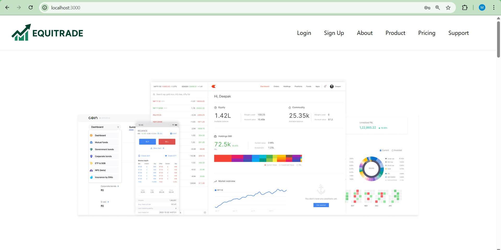
    </a>
    <p><strong>Home Page</strong></p>
  </td>

  <td align="center">
    <a href="Project_Screenshots/frontend_home2.jpg">
      
    </a>
    <p><strong>Home Page (Alt Section)</strong></p>
  </td>
</tr>

<tr>
  <td align="center">
    <a href="Project_Screenshots/frontend_home3.jpg">
      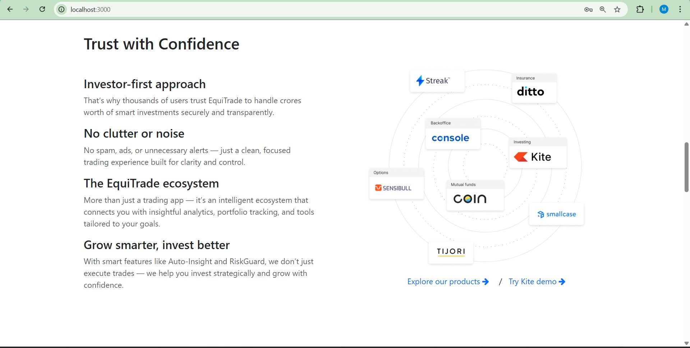
    </a>
    <p><strong>Home Section</strong></p>
  </td>

  <td align="center">
    <a href="Project_Screenshots/frontend_pricing.jpg">
      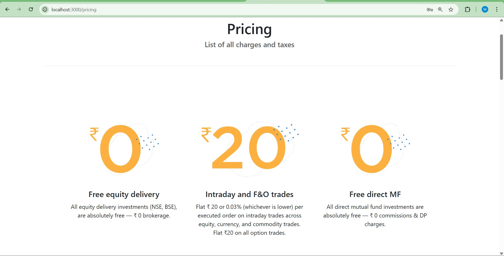
    </a>
    <p><strong>Pricing</strong></p>
  </td>
</tr>

<tr>
  <td align="center">
    <a href="Project_Screenshots/frontend_products.jpg">
      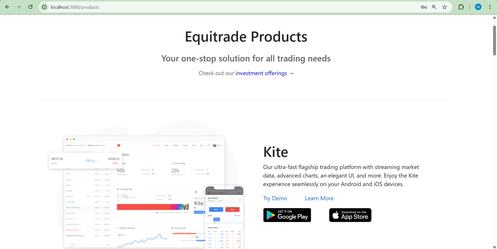
    </a>
    <p><strong>Products</strong></p>
  </td>

  <td align="center">
    <a href="Project_Screenshots/frontend_products2.jpg">
      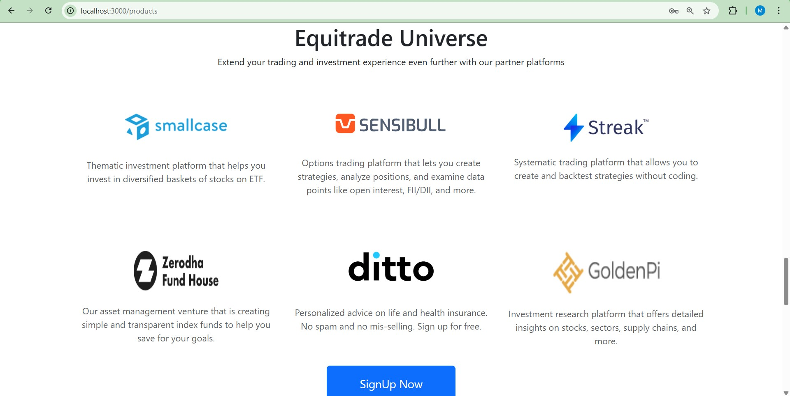
    </a>
    <p><strong>Products (Alt Section)</strong></p>
  </td>
</tr>

<tr>
  <td align="center">
    <a href="Project_Screenshots/frontend_about.jpg">
      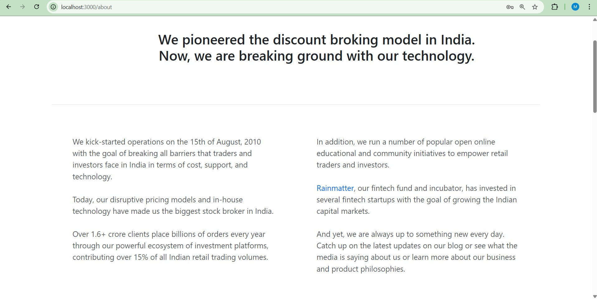
    </a>
    <p><strong>About</strong></p>
  </td>

  <td align="center">
    <a href="Project_Screenshots/frontend_about2.jpg">
      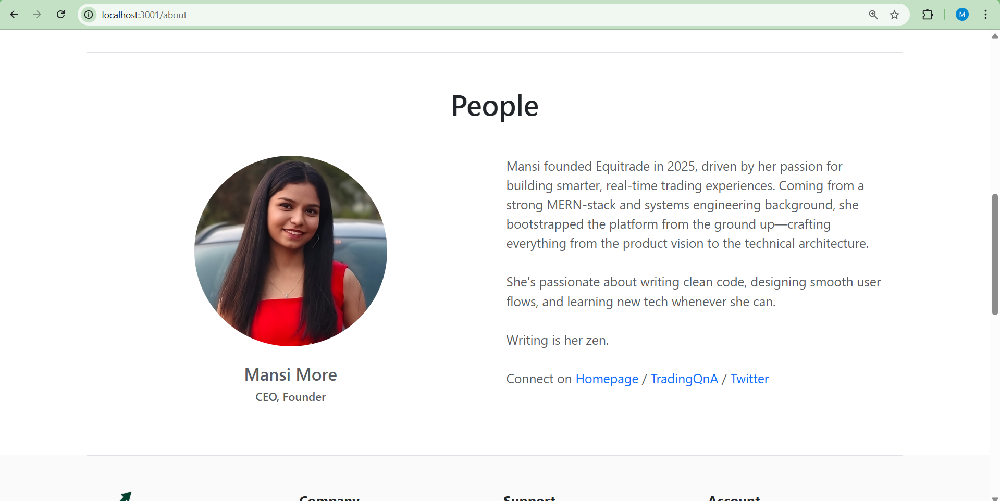
    </a>
    <p><strong>About (Alt)</strong></p>
  </td>
</tr>

<tr>
  <td align="center">
    <a href="Project_Screenshots/frontend_support.jpg">
      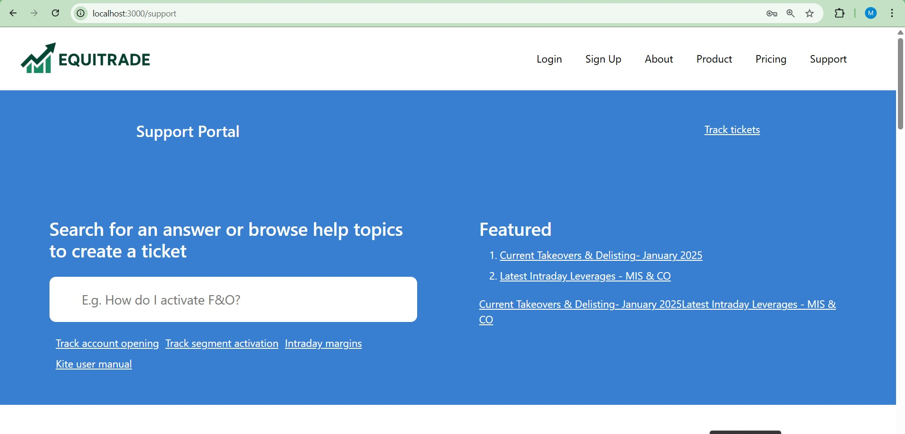
    </a>
    <p><strong>Support</strong></p>
  </td>

  <td align="center">
    <a href="Project_Screenshots/frontend_support2.jpg">
      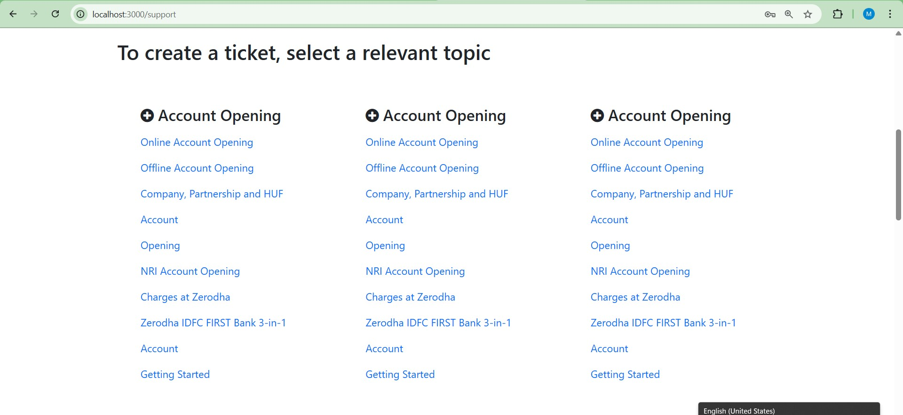
    </a>
    <p><strong>Support (Alt)</strong></p>
  </td>
</tr>


<!-- ========================== -->
<!--   2. AUTHENTICATION PAGES   -->
<!-- ========================== -->

<tr><td colspan="2" align="center"><h3>🔐 Authentication Screens</h3></td></tr>

<tr>
  <td align="center">
    <a href="Project_Screenshots/authentication_signin.jpg">
      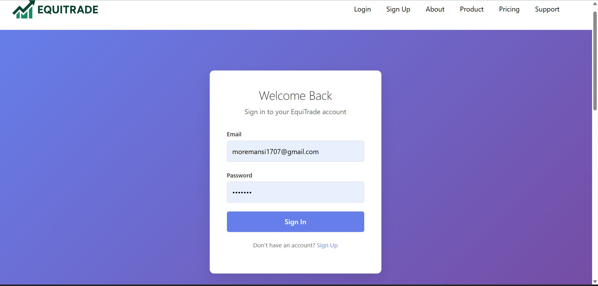
    </a>
    <p><strong>Sign In</strong></p>
  </td>

  <td align="center">
    <a href="Project_Screenshots/authentication_signup.jpg">
      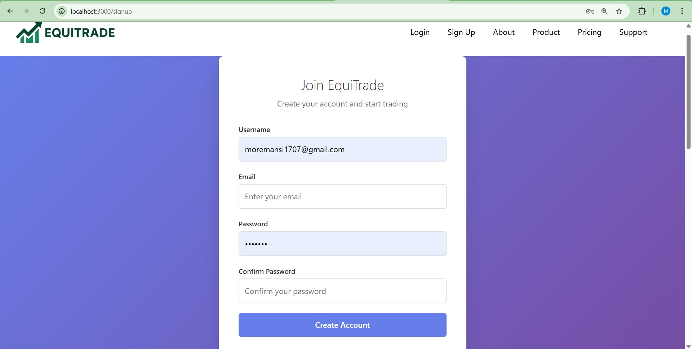
    </a>
    <p><strong>Sign Up</strong></p>
  </td>
</tr>


<!-- ========================== -->
<!--     3. DASHBOARD PAGES     -->
<!-- ========================== -->

<tr><td colspan="2" align="center"><h3>📊 Dashboard Screens</h3></td></tr>

<tr>
  <td align="center">
    <a href="Project_Screenshots/dashboard.jpg">
      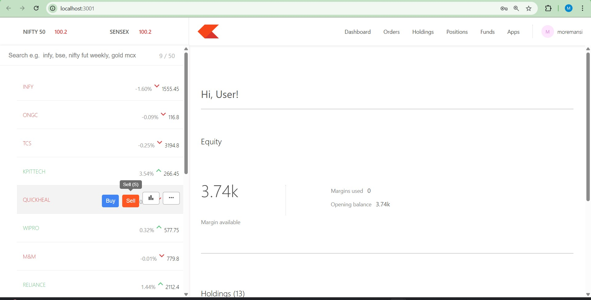
    </a>
    <p><strong>Dashboard Overview</strong></p>
  </td>

  <td align="center">
    <a href="Project_Screenshots/dashboard2.jpg">
      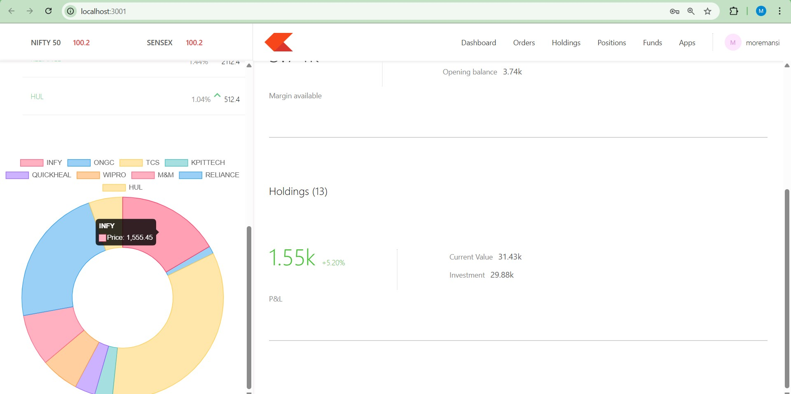
    </a>
    <p><strong>Dashboard (Alt View)</strong></p>
  </td>
</tr>

<tr>
  <td align="center">
    <a href="Project_Screenshots/dashboard_funds.jpg">
      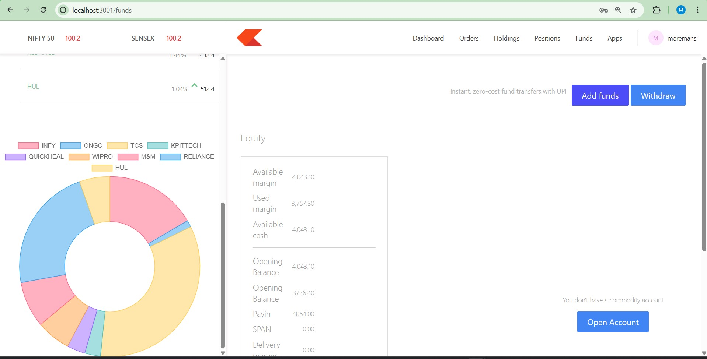
    </a>
    <p><strong>Funds</strong></p>
  </td>

  <td align="center">
    <a href="Project_Screenshots/dashboard_holdings.jpg">
      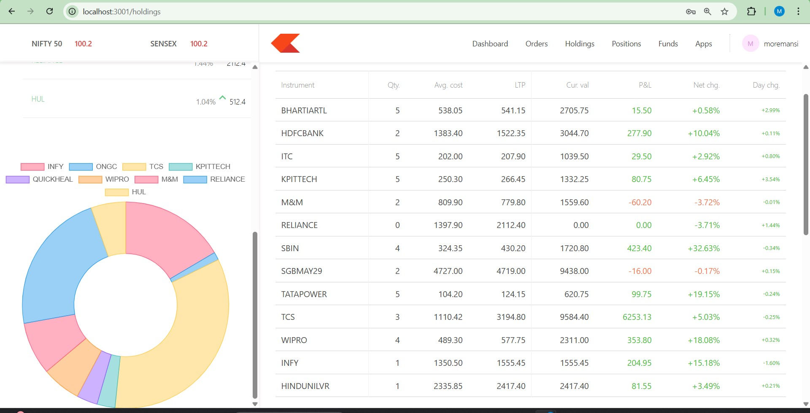
    </a>
    <p><strong>Holdings</strong></p>
  </td>
</tr>

<tr>
  <td align="center">
    <a href="Project_Screenshots/dashboard_orders.jpg">
      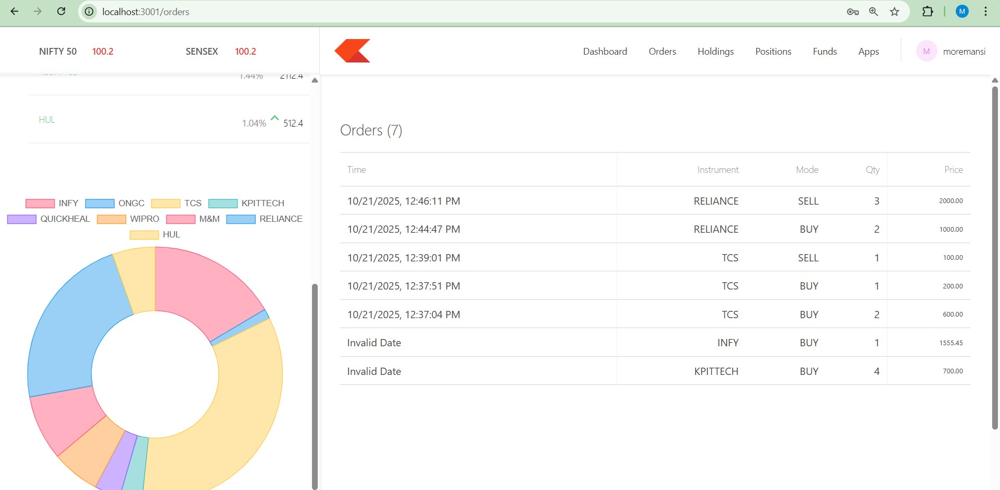
    </a>
    <p><strong>Orders</strong></p>
  </td>

  <td align="center">
    <a href="Project_Screenshots/dashboard_holdings.png">
      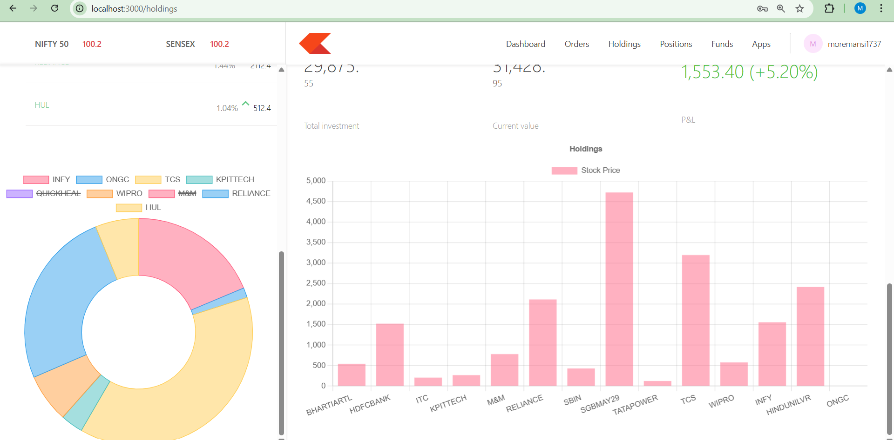
    </a>
    <p><strong>Holdings (PNG)</strong></p>
  </td>
</tr>


<!-- ========================== -->
<!--          FOOTER           -->
<!-- ========================== -->

<tr><td colspan="2" align="center"><h3>🟦 Footer</h3></td></tr>

<tr>
  <td align="center" colspan="2">
    <a href="Project_Screenshots/footer.jpg">
      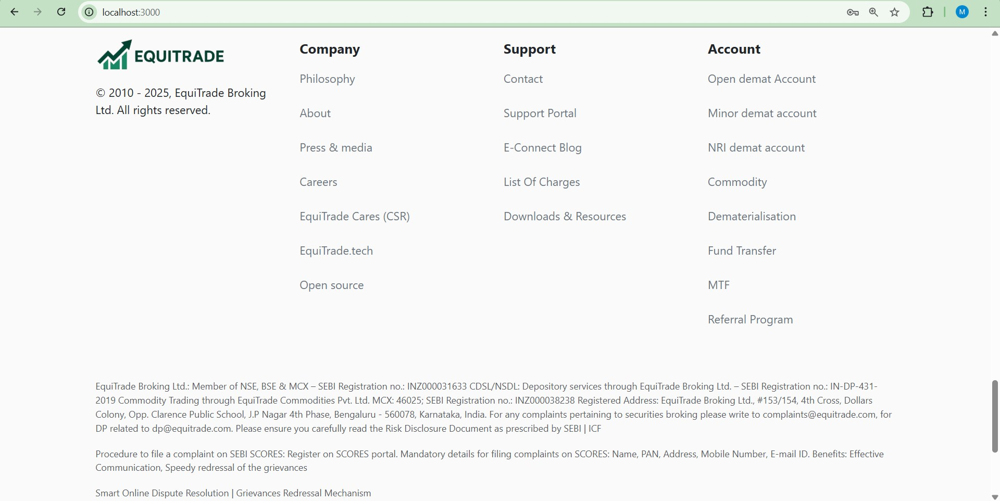
    </a>
    <p><strong>Footer</strong></p>
  </td>
</tr>

</table>

<p align="center"><i>Click any screenshot to view full-size.</i></p>

</details>


---

## 🧠 Tech Stack

**Frontend**
- React (Hooks) · React Router  
- Material UI (MUI) · FontAwesome  
- Chart.js / Recharts  
- Axios

**Backend**
- Node.js · Express  
- MongoDB · Mongoose  
- JWT Authentication · Bcrypt

**Other**
- Mock/static JSON for market data  
- Local storage for quick UX caching  
- MVC-style backend organization

---

## Architecture

**High-level flow**
User (Browser) → React UI → REST API (Express) → MongoDB
↑
└── Mock Stock Data (JSON)


- Frontend communicates with the backend via REST endpoints.  
- Mock stock engine (static JSON) drives charts & details; easy to switch to a live API later.  
- Portfolio and transactions persisted in MongoDB.

---

## Project Structure

<p align="center">
  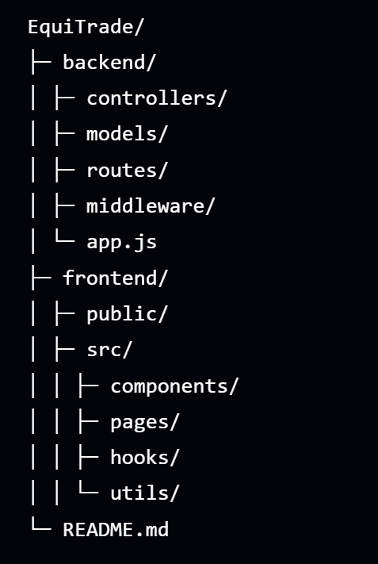
</p>


---


---

## 🔧 Quick Start

**(Copy -> paste -> run — all code form; set your `MONGO_URI` & `JWT_SECRET` in `.env`)**

```bash
# 1) Clone repo
git clone https://github.com/<your-username>/EquiTrade.git
cd EquiTrade

# 2) Backend setup & run
cd backend
cp .env.example .env         # edit .env: set MONGO_URI, JWT_SECRET, PORT (optional)
npm install
# Development (nodemon)
npm run dev
# or production
# npm start


# 3) Frontend setup & run (open new terminal)
cd ../frontend
cp .env.example .env         # set REACT_APP_API_URL or VITE_API_URL to http://localhost:8000
npm install
npm run dev                  # opens http://localhost:5173 (Vite) by default

# 4) (Optional) Seed sample user & mock data
# from backend folder (if seed script exists)
# node scripts/seed.js

# 5) Open app
# Frontend -> http://localhost:5173
# Backend API -> http://localhost:8000 (or value in .env)


```
---

## 🛠️ Troubleshooting

- ❌ **Portfolio not updating?**  
  ✔ Ensure the backend server is running  
  ✔ Verify `VITE_API_URL` / `REACT_APP_API_URL` in the frontend `.env`

- ❌ **Charts not loading?**  
  ✔ Confirm mock JSON path  
  ✔ Check browser devtools → Network → the GET request should return your JSON file

- ❌ **Authentication failing?**  
  ✔ Make sure `JWT_SECRET` is correctly set  
  ✔ Check if MongoDB is connected (local or Atlas)

- ❌ **Local images not showing?**  
  ✔ Ensure folder exists: `/screenshots/`  
  ✔ Filenames must match exactly (case-sensitive)

---

## 💼 What This Project Demonstrates: 

- 🚀 Built a **full end-to-end MERN application** with authentication, protected routes, and persistent database storage.  
- 🧩 Designed a **clean, modular codebase** following MVC patterns, reusable components, and proper separation of concerns.  
- 💸 Developed a **realistic virtual trading engine** (wallet deduction/addition, validation rules, P/L calculation).  
- 📊 Implemented **interactive data visualizations** using Chart.js for stock history & portfolio insights.  
- 🎨 Crafted a **professional, responsive UI** using Material UI — focusing on usability, accessibility, and consistency.  
- 🧠 Demonstrated strong knowledge of **state management, REST APIs, MongoDB schema design, and secure JWT auth**.

---

## ⚖️ Tech Decisions & Tradeoffs

### 🧪 Mock Data vs Live APIs
- ✔ Guaranteed stability, no rate limits, no API outages  
- ✔ Perfect for demos and offline development  
- ✖ Not real-time (no live market sync)

### 🎨 Material UI for Frontend
- ✔ Fast development with polished components  
- ✔ Built-in responsiveness & accessibility  
- ✖ Larger bundle size vs Tailwind/custom CSS

### 🔌 REST API Instead of GraphQL
- ✔ Simpler architecture for this project  
- ✔ Easy onboarding for new developers  
- ✖ Nested/complex queries require more endpoints

---

## ✍️ Developer Notes

- Use `.jsx` for all UI components to avoid bundler/IDE parsing issues.  
- Portfolio values are calculated on the server for reliability; frontend only displays them.  
- To support real APIs later, replace the mock-data adapter with a fetcher (AlphaVantage/Finnhub).  
- If adding real-time updates, use `ontrack`/`addTrack` patterns for WebRTC-like streams (future extension).  

---

## 🤝 Contributing

1. 🍴 **Fork** this repository  
2. 🌿 Create a branch:  
3. 🧪 Implement & test your changes  
4. 📸 Add screenshots or screen recordings if UI changes are introduced  
5. 🔄 Submit a **PR** with a clear explanation and testing steps  

> For non-trivial features, please include test instructions or example payloads.


## 📬 Connect With Me

[](https://www.linkedin.com/in/mansimore0817)

<p align="center">Built by <b>Mansi More</b> • moremansi1707@gmail.com</p>
